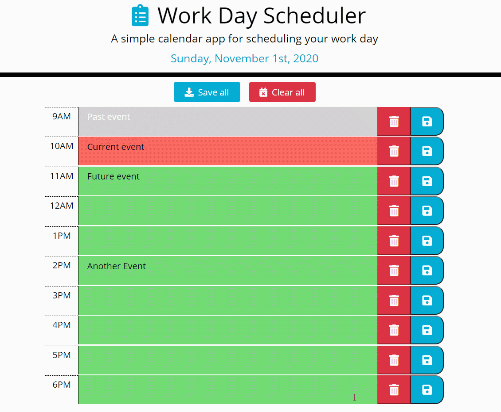

## Work Day Scheduler              

**Work Day Scheduler** - a simple calendar application that allows a user to save events for each hour of the day.

## Installation

Web Application can be accessed at [elogonme.github.io/work-scheduler/](https://elogonme.github.io/work-scheduler/)

## Usage

The current day and list of work hours is displayed on initial app loading.
Click on any hour text area to add task. Click on save button to save task. Click on clear button to clear task.
Click on Save all or Clear All buttons to save or clear all at once.
Schedule will be saved in local storage and will be reloaded on next run of application.
Each time block is color-coded to indicate whether it is in the past, present, or future.

## Repository

All web app `code` is available at repository [github.com/elogonme/work-scheduler](https://github.com/elogonme/work-scheduler)

## Credits

Coded by Eldar Humbatov [github.com/elogonme](https://github.com/elogonme)

## License

This source code is available to everyone under the standard 
